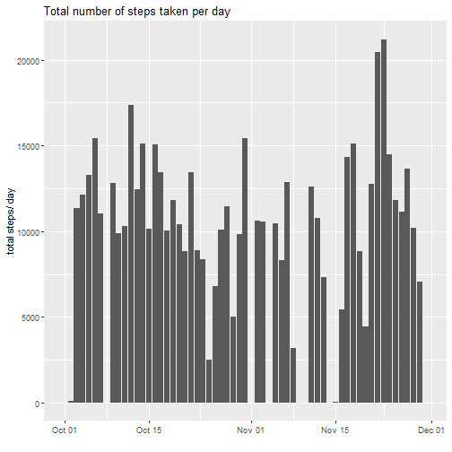
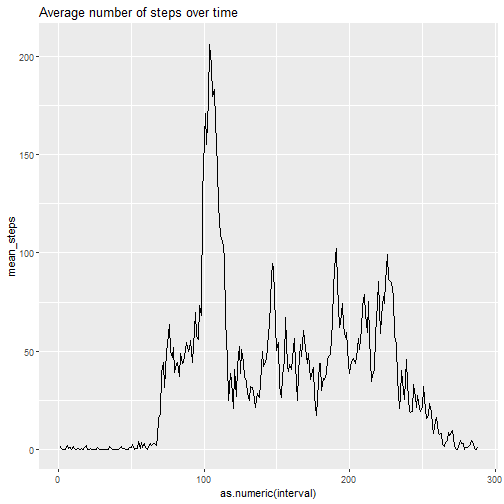
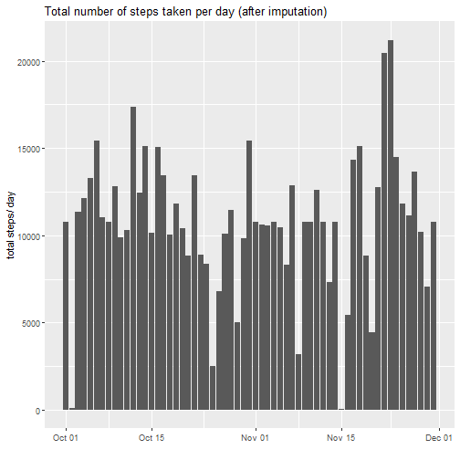
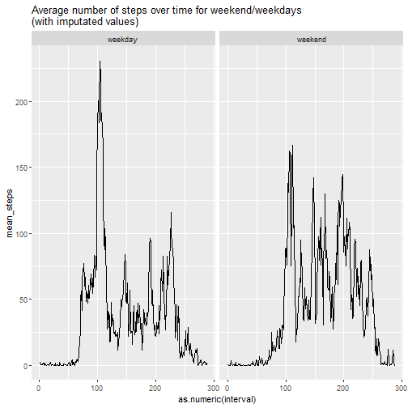

### load libraries and project data

```r
library(plyr)
library(dplyr)
library(tidyr)
library(ggplot2)

data <- read.csv("activity.csv")   #read data
data$date <- as.Date(data$date)    #transform dates to date class

# rename intervals
data$interval <- as.factor(data$interval)
levels(data$interval) <- as.integer(c(1:288))
```


## What is mean total number of steps taken per day?

*Histogram of the total number of steps taken each day*


```r
# calculate total steps for each day
sum_df <- ddply(data, .(date), summarize, 
                total_steps = sum(steps, na.rm = T))  

# plot steps per day
ggplot(sum_df, aes(x=date, y=total_steps))+
  geom_histogram(stat = "identity")+
  xlab("")+
  ylab("total steps/ day")+
  ggtitle("Total number of steps taken per day")
```




*Calculate and report the mean and median of the total number of steps taken per day*

```r
# calculate mean of total steps per day
mean <- round(mean(sum_df$total_steps),0) 

# calculate median of total steps per day
median <- round(median(sum_df$total_steps),0)
```
The mean of the total number of steps is **9354** and the median **1.0395 &times; 10<sup>4</sup>**.


## What is the average daily activity pattern?
*Make a time series plot (i.e. type="l") of the 5-minute interval (x-axis) and the average number of steps taken, averaged across all days (y-axis)*

```r
# average steps for each time interval over all days
int_sum <- ddply(data, .(interval), summarize,
                 mean_steps = mean(steps, na.rm=T))

# plot mean steps over time
ggplot(int_sum, aes(x=as.numeric(interval), y=mean_steps))+
  geom_line()+
  ggtitle("Average number of steps over time")
```



*Which 5-minute interval, on average across all the days in the dataset, contains the maximum number of steps?*

```r
# calculate time interval with the highest mean steps
max_steps <- max(int_sum$mean_steps, na.rm=T) 
max_int <- int_sum$interval[int_sum$mean_steps == max_steps]
```

The interval **`max_int`** contains the maximum number of steps on average. 


## Imputing missing values
Note that there are a number of days/intervals where there are missing values (coded as NA. The presence of missing days may introduce bias into some calculations or summaries of the data.

*Calculate and report the total number of missing values in the dataset (i.e. the total number of rows with NAs*

```r
NAs <- nrow(data[is.na(data$steps),])  #count rows with NA in step variable
```

The dataset contains **2304** missing values.

*Devise a strategy for filling in all of the missing values in the dataset. The strategy does not need to be sophisticated. For example, you could use the mean/median for that day, or the mean for that 5-minute interval, etc.*

*Create a new dataset that is equal to the original dataset but with the missing data filled in.*

```r
vec <- (1:nrow(data))[is.na(data$steps)] # vector defining rows with missing values
data_imp <- data                         # new data frame with imputed values

# loop over missing steps and add average for this time interval
for(i in 1:length(vec)){
  data_imp$steps[vec[i]] <- int_sum$mean_steps[int_sum$interval == data$interval[vec[i]]]
}
```
Missing values were replaced by the average of the time interval were the missing value occured. The data set with the imputed values was named **data_imp**.

*Make a histogram of the total number of steps taken each day and Calculate and report the mean and median total number of steps taken per day. Do these values differ from the estimates from the first part of the assignment? What is the impact of imputing missing data on the estimates of the total daily number of steps?*

```r
# calculate total steps for each day
sum_df_imp <- ddply(data_imp, .(date), summarize, 
                total_steps = sum(steps, na.rm = T))  

# plot steps per day
ggplot(sum_df_imp, aes(x=date, y=total_steps))+
  geom_histogram(stat = "identity")+
  xlab("")+
  ylab("total steps/ day")+
  ggtitle("Total number of steps taken per day (after imputation)")
```

```
## Warning: Ignoring unknown parameters: binwidth, bins, pad
```



```r
# calculate mean of total steps per day
mean_imp <- round(mean(sum_df_imp$total_steps),0) 

# calculate median of total steps per day
median_imp <- round(median(sum_df_imp$total_steps),0)
```
The mean of the total number of steps is **1.0766 &times; 10<sup>4</sup>** and the median **1.0766 &times; 10<sup>4</sup>** compared to **9354** and  **1.0395 &times; 10<sup>4</sup>** before imputation. The values increased after imputation.

## Are there differences in activity patterns between weekdays and weekends?

*Create a new factor variable in the dataset with two levels – “weekday” and “weekend” indicating whether a given date is a weekday or weekend day.*


```r
# add variable with weekdays to data_imp
data_imp$weekday <- weekdays(data_imp$date)

# add variable with weekday or weekend
data_imp$weekend <- NA
data_imp$weekend[data_imp$weekday == "Saturday"| 
                   data_imp$weekday == "Sunday"] <- "weekend"
data_imp$weekend[is.na(data_imp$weekend)] <- "weekday"
```

*Make a panel plot containing a time series plot (i.e. type="l") of the 5-minute interval (x-axis) and the average number of steps taken, averaged across all weekday days or weekend days (y-axis). See the README file in the GitHub repository to see an example of what this plot should look like using simulated data.*

```r
# calculate mean steps per time interval for weekend and weekday separately
int_sum_weekend <- ddply(data_imp, .(interval, weekend), summarize,
                         mean_steps = mean(steps))

# plot mean steps over time for each weekday and weekend
ggplot(int_sum_weekend, aes(x=as.numeric(interval), y=mean_steps))+
  geom_line()+
  ggtitle("Average number of steps over time for weekend/weekdays  \n(with imputated values)")+
  facet_wrap(.~weekend)
```



